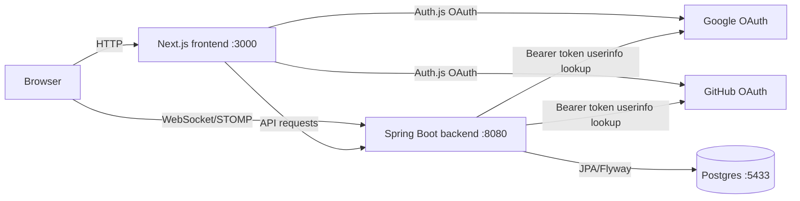

# Games of the General

Online multiplayer implementation of Games of the General, a hidden-rank strategy board game where players arrange a private formation, maneuver pieces across an 8 x 9 board, resolve challenges through a server-side arbiter, and win by capturing the opposing Flag or reaching the opposite end with their own.

## Project Overview

This repository contains a production-shaped full-stack game app:

- Next.js frontend for the landing page, authentication, lobby, match invites, match history, and live match room.
- Spring Boot backend for OAuth-backed sessions, user profiles, match creation, matchmaking, setup validation, move rules, battle resolution, chat, and realtime match events.
- Postgres persistence with Flyway migrations for users, matches, seats, pieces, moves, matchmaking queue entries, rematches, and chat messages.
- Generated OpenAPI TypeScript types shared with the frontend.
- Flutter mobile client scaffold that can consume the same backend API.

## Short About Description

Games of the General is a full-stack web version of the classic Filipino hidden-rank strategy game, built with Next.js, Spring Boot, Postgres, and realtime match updates.

## Prerequisites

- Node.js 20
- pnpm 10.12.1, via Corepack or a local install matching `packageManager`
- Java 21
- Docker with Docker Compose
- Flutter SDK and Dart, only for mobile work

## Local Setup

Install workspace dependencies:

```bash
pnpm install
```

Create local environment files:

```bash
cp apps/frontend/.env.example apps/frontend/.env
cp apps/backend/.env.example apps/backend/.env
```

The Docker Compose Postgres service is exposed on host port `5433` by default. Update `apps/backend/.env` for the local database:

```env
SPRING_DATASOURCE_URL=jdbc:postgresql://localhost:5433/app
SPRING_DATASOURCE_USERNAME=postgres
SPRING_DATASOURCE_PASSWORD=postgres
```

Fill in `apps/frontend/.env` with Auth.js settings and OAuth credentials if you need real Google or GitHub sign-in. See [docs/google-github-oauth-setup.md](docs/google-github-oauth-setup.md).

## Run Locally

Start infrastructure and all dev servers:

```bash
make dev
```

Default services:

- Frontend: `http://localhost:3000`
- Backend API: `http://localhost:8080`
- WebSocket endpoint: `ws://localhost:8080/ws`
- Postgres: `localhost:5433`

Useful routes:

- `/` - landing page
- `/login` and `/signup` - authentication screens
- `/lobby` - create matches, find matches, manage settings, and view active games
- `/lobby/history` - match history
- `/lobby/invite/[inviteCode]` - private invite join flow
- `/matches/[matchId]` - live game board, setup, movement, chat, rematch, and leave flow

## Architecture



## Repo Layout

```text
apps/
  backend/       Spring Boot API, game engine services, Flyway migrations, tests
  frontend/      Next.js app, Auth.js, lobby and match UI, realtime hooks
  mobile/        Flutter app scaffold, Riverpod, Dio, generated OpenAPI client
packages/
  api-types/     TypeScript types generated from OpenAPI
infra/
  docker-compose.yml
  postgres/      Local database initialization
docs/
  game-rules.md  Rules source of truth for the game engine
  adr/           Architecture decision records
  tickets/       Implementation tickets and completion history
```

## Game Features

- 8 x 9 board with 21 pieces per player.
- Hidden opponent ranks with viewer-specific game-state projections.
- Server-owned setup validation for legal formation placement.
- Orthogonal one-square movement and legal move calculation.
- Battle resolution for officers, spies, privates, flags, and equal-rank eliminations.
- Win conditions for Flag capture and Flag reaching the opposite end.
- Private match creation, invite links, public match listing, matchmaking queue, rematches, and match history.
- Match chat and presence/update events over WebSockets.

For detailed rules, see [docs/game-rules.md](docs/game-rules.md).

## Common Commands

```bash
make dev                         # start Postgres and all dev servers
make infra                       # start only Postgres
make down                        # stop Docker services
make reset                       # stop Docker services and remove Postgres data
make backend-test                # run Spring Boot tests
make backend-build               # build backend
pnpm --filter @app/frontend lint
pnpm --filter @app/frontend typecheck
pnpm --filter @app/frontend build
pnpm --filter @app/api-types generate:types
make mobile-test                 # flutter analyze && flutter test
```

## API Types

The frontend consumes generated TypeScript definitions from `packages/api-types`.

To refresh them from a running backend:

```bash
pnpm --filter @app/api-types fetch:spec
pnpm --filter @app/api-types generate:types
```

## Testing

```bash
make backend-test
pnpm --filter @app/frontend lint
pnpm --filter @app/frontend typecheck
make mobile-test
```

Backend tests cover the match rules, setup, movement, win conditions, chat, matchmaking, OAuth-backed auth behavior, repositories, and controller integration paths. The frontend test script is currently a placeholder until a Jest, Vitest, or Playwright suite is added.

## Deployment Notes

See [docs/free-deployment-guide.md](docs/free-deployment-guide.md) for a free-friendly deployment path using Vercel for the Next.js frontend, Render for the Spring Boot backend, and Neon for Postgres.

## ADRs

Architecture decisions live in [docs/adr/](docs/adr/). ADR files are append-only: supersede old decisions with a new ADR instead of editing history.
