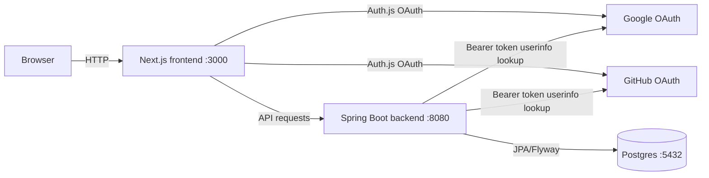

# Todo App Monorepo

## Project Overview

This repository is a full-stack todo application used as a production-shaped reference for a Next.js frontend, Spring Boot backend, direct Google/GitHub OAuth login, Postgres persistence, generated OpenAPI TypeScript types, and GitHub Actions image publishing.

## Prerequisites

- Node.js 20
- pnpm 10.12.1, via Corepack or a local install matching `packageManager`
- Java 21
- Docker with Docker Compose

## One-Command Start

```bash
make dev
# Postgres :5432, backend :8080, frontend :3000
```

Open `http://localhost:3000/todos`. The protected route redirects to Google/GitHub login when you are not signed in.

## Architecture



## Repo Layout

```text
apps/
  backend/       Spring Boot API, Flyway migrations, tests
  frontend/      Next.js app, Auth.js, TanStack Query, shadcn/ui
  mobile/        Flutter app, Riverpod, Dio, generated OpenAPI client
packages/
  api-types/     TypeScript types generated from OpenAPI
infra/
  docker-compose.yml
  postgres/      Local database initialization
docs/
  adr/           Architecture decision records
  tickets/       Implementation tickets and completion history
```

## State Layering Convention

| State type         | Owner          |
| ------------------ | -------------- |
| Server state       | TanStack Query |
| Session/auth       | Auth.js        |
| Ephemeral UI state | Zustand        |

Keep these layers separate. Do not copy API entities into Zustand, and do not use TanStack Query for local UI controls.

## Add a Backend Module

1. Create a vertical slice for the feature under `apps/backend/src/main/java/com/vencentdev/backend/<name>/`, following the existing package style: `controller`, `service`, `repository`, `entity`, `dto`, and `mapper`.
2. Use Lombok for JPA entities, Java records for DTOs, and MapStruct for mapper boundaries.
3. Add a Flyway migration such as `apps/backend/src/main/resources/db/migration/V<n>__<name>.sql`.
4. Add repository tests with `@DataJpaTest` when persistence behavior matters.
5. Add API integration tests by extending `IntegrationTestBase`.
6. Keep security behavior explicit in controller integration tests.

## Add a Frontend Feature

1. Add the page under `apps/frontend/src/app/app/<feature>/page.tsx` for authenticated app routes.
2. Add a hook such as `apps/frontend/src/hooks/use<Feature>.ts`.
3. Type API inputs and responses through `@app/api-types`.
4. Use TanStack Query for server data and mutations.
5. Add a Zustand store only for ephemeral UI state such as filters, selected tabs, or drawer state.
6. Keep shared UI primitives in `apps/frontend/src/components/ui`.

## Configure Google and GitHub Login

See [`docs/google-github-oauth-setup.md`](docs/google-github-oauth-setup.md) for the required Google/GitHub OAuth apps, callback URLs, and local environment variables.

## Testing

```bash
make backend-test
pnpm --filter @app/frontend lint
pnpm --filter @app/frontend typecheck
pnpm --filter @app/frontend test --if-present
make mobile-test   # flutter analyze && flutter test (see apps/mobile/README.md)
```

The backend tests use Testcontainers for Postgres. The frontend test script is currently a placeholder until a Jest, Vitest, or Playwright suite is added.

## CI

GitHub Actions is defined in [`.github/workflows/ci.yml`](.github/workflows/ci.yml).

- Pull requests run backend, frontend, and mobile (Flutter analyze + test) jobs.
- Pushes to `main` run tests and publish images to GHCR:
  - `ghcr.io/<owner>/<repo>/backend:latest`
  - `ghcr.io/<owner>/<repo>/backend:<sha>`
  - `ghcr.io/<owner>/<repo>/frontend:latest`
  - `ghcr.io/<owner>/<repo>/frontend:<sha>`

Repository settings must allow GitHub Actions read/write package permissions for GHCR publishing.

## ADRs

Architecture decisions live in [`docs/adr/`](docs/adr/). ADR files are append-only: do not renumber them, and supersede old decisions with a new ADR instead of editing history.
